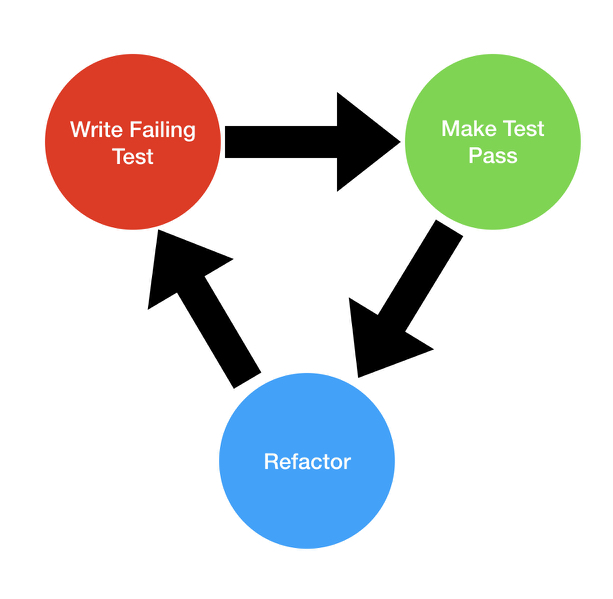
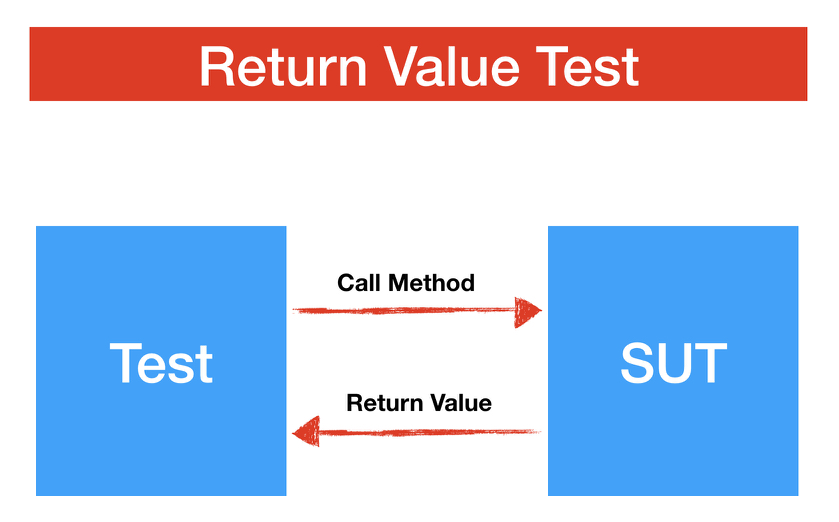
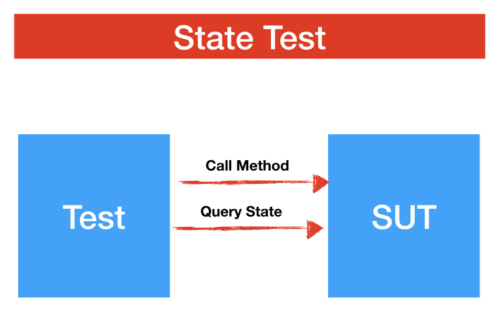
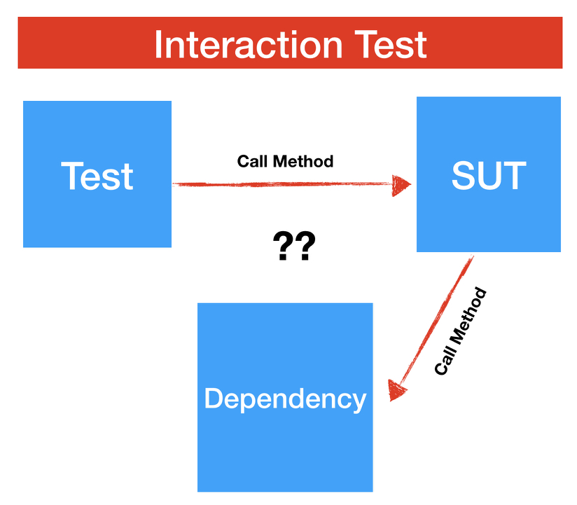
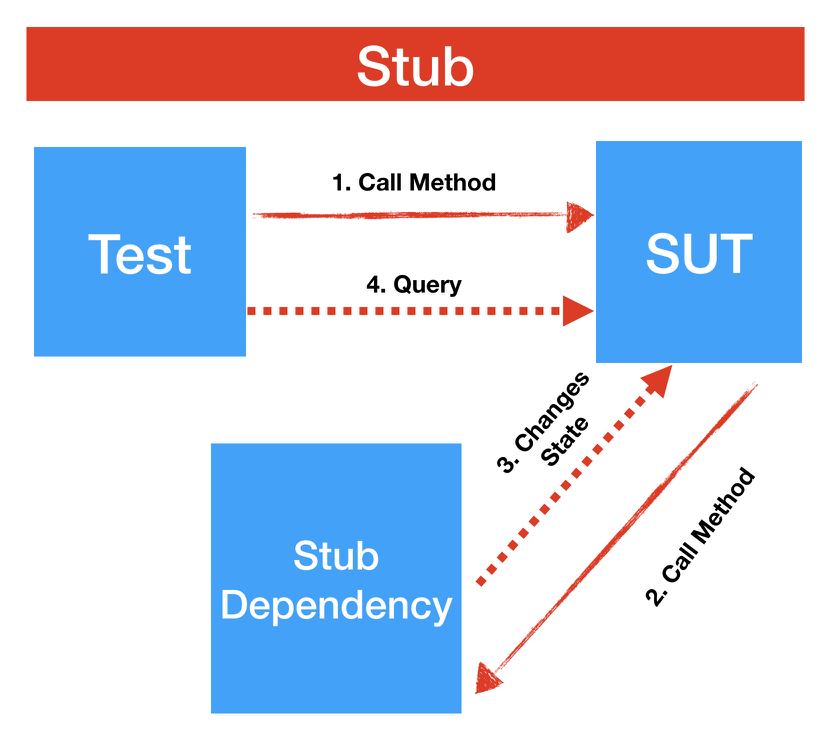
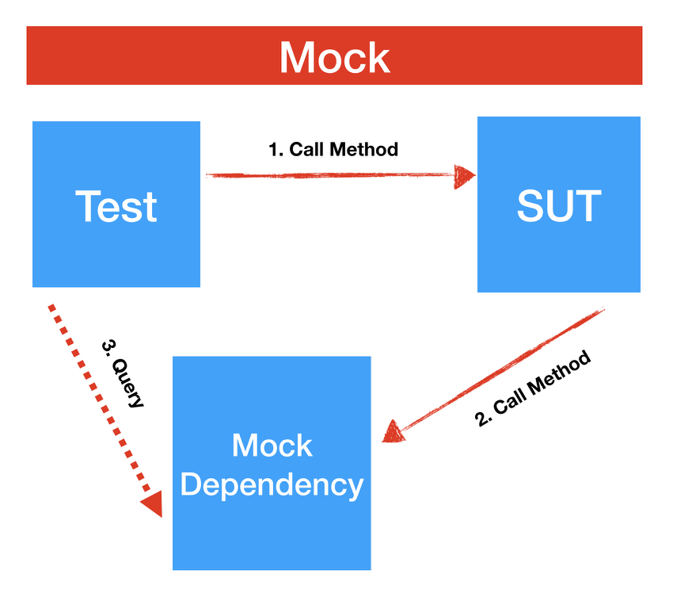

autoscale: true
build-lists: true

# [fit]What is testing and why do it?
- Testing most relevant for projects that are intended to live past initial ship date.
- Testing is a way to objectively verify quality.
- We already test our code by stepped through our code and using the debugger. 
- What are some problems with testing our code this way?
- Writing unit tests is a way for us to write test code that is not shipped with production code.

# [fit]Types of Software Tests
- There are many types of software tests, such as security testing, installation testing, accessibility testing, etc.  [Software Testing](https://en.wikipedia.org/wiki/Software_testing) 
- Software testing and QA (Quality Assurance) is a separate dicipline. 
- We are only concerned about *unit testing*, today.
- Xcode has an [interface testing framework](https://developer.apple.com/library/content/documentation/DeveloperTools/Conceptual/testing_with_xcode/chapters/09-ui_testing.html) which we won't be covering today.
- Unit testing tests small units of code, usually functions/methods.
- Unit tests are distinct from *integration tests* (or functional tests).
- Integration tests test larger chunks of code and how they function together. This might involve hitting an actual network.

# [fit]Advantages of Unit Testing
- We spend more time writing code rather than hanging out in the debugger.
- Find bugs early in the development process.
- Provides living documentation.
- Guides better code architecture.
- Allows us to make changes to our code with more confidence.
- Catches regression bugs in later versions.
- Forces us to reason more thoroughly about our code.
- Sleep better at night. 💤

# [fit]Disadvantages of Unit Testing
- We write a lot more code!
- It takes developer time away from adding exciting features.
- Not as exciting as adding features.
- If done incorrectly it can hamper progress.

# [fit]TDD (Test Driven Development)
- TDD is the discipline of writing unit tests *first*, before production code.
- Sometimes called "Red, Green, Refactor".

**Steps:**

  1. Write a single failing test.
  
  2. Write the simplest code to make that test pass.
  
  3. Refactor your production code and test code.

---

# [fit]Red, Green, Refactor



# [fit]Some Beginning Rules
- Only ever test publicly exposed methods. Why?
- Never test Apple's code!
- Never test actual API calls. Why? 
- Simple classes/functions are much easier to test. So, make your classes/functions simpler.  🧘🏼‍♂️

# [fit]The 3 A's Of Unit Testing
1. Arrange. 
2. Act.
3. Assert.

// Arrange<br>
// Act<br>
// Assert<br>

# [fit]3 Types of Unit Tests:
1. Return Value
2. State Test
3. Interaction Test

# [fit]1) Return Value Test:

- calling a function returns a value. 
- compare it to an expected value.

---



---

# [fit]2) State Test: 
- calling a function causes a side effect (like a property changes value).
- query the object to see if the changed state matches your expectations. 
  
---




# [fit]3) Interaction Test:
- Your test calls a method and that method calls something else.
- Eg. Your PersonManager has a saveUser method that saves the passed in Person to UserDefaults.
- We don't want to use the actual UserDefaults to test this. Why not?	
  
---
  
  

# [fit]Interaction Tests & Dependency Injection
- Before we talk about the 2 types of interaction tests, let's take a closer look at dependencies.
- When you are doing interaction testing your sut (System Under Test) is dependent on other classes or modules.
- We usually want to use fake dependencies and not real ones. 
- We **always** want to make sure we "inject" these dependencies rather than "new them up" internally.

---

```swift
// Wrong
class PersonManager {
  private let defaults: UserDefaults
  init() {
    defaults = UserDefaults.standard
  }
}

// Right
class PersonManager {
  private let defaults: UserDefaults
  init(defaults: UserDefaults) {
    self.defaults = defaults
  }
}
```

---

# [fit]4 Ways of Doing Dependency Injection:

1. Extract & Override
2. Method Injection
3. Property Injection
4. Constructor Injection


# [fit]1) Extract & Override:
- Handy when you can't change method signatures. 
- Fragile if you refactor the name of the extracted method (which is only an internal dependency).

---

```swift
// Wrong
class PersonManager {
  
func save(person: Data){
	let defaults = UserDefaults.standard
	defaults.setValue(person, forKey: "personKey")
	}
}

// Right
class PersonManager {
  
  func save(person: Data){
    defaults().setValue(person, forKey: "personKey")
    }
  
  func defaults()->UserDefaults {
    return UserDefaults.standard
  }
}

```

---

// Subclass & Override

```swift
class TestablePersonManager: PersonManager {
  override func defaults() -> UserDefaults {
    return //something?
  }
}

``` 

- What is the problem here?


# [fit]2) Method Injection: 

- Pass the dependency in via a parameter to the method.
- Available only if you have the power to change the method signature.


```swift
class PersonManager {
  
func save(person: Data, with defaults: UserDefaults){
defaults.setValue(person, forKey: "personKey")
  }
}
```

# [fit]3) Property Injection:

```swift
class PersonManager {
  
  var defaults: UserDefaults?
  
  func save(person: Data){
    defaults?.setValue(person, forKey: "personKey")
  }
}
```
		
# [fit]4) Constructor Injection:

- Passes in the dependencies as parameter(s) to the initializer.
- Prefer constructor injection because it makes the dependencies more explicit.

---

```swift
class PersonManager {
  
  var defaults: UserDefaults
  
  init(defaults: UserDefaults) {
    self.defaults = defaults
  }
  
  func save(person: Data){
    defaults.setValue(person, forKey: "personKey")
  }
  
}
```	

# [fit]Stubs Vs Mocks

- We usually don't want to inject an actual defaults object or whatever other dependency. We want a fake of some kind that we can **control**.
- There are 2 fundamental types of fake objects: Stubs and Mocks.
- The difference has to do with what object the test queries. 
- For stubs, the test queries the sut for state changes.
- For mocks, the tests query the mock object for changes.

---



---



---

# [fit]@testable

```swift
import XCTest
@testable import UnitTests

class BillComputerTests: XCTestCase {
}
```
-  removes need to make everything `public` or `open` in the file, or add the file to the test target.
- Do not add the production target to the test target!

# [fit]Resources
- if you want to start with TDD start with a codekata [link](https://qualitycoding.org/tdd-kata/)
- Jon Reid's [Quality Coding](https://qualitycoding.org) is a good site to start.
- A lot of the ideas in this lecture are inspired by [this](https://www.youtube.com/watch?v=Jzlz3Bx-NzM) video.
